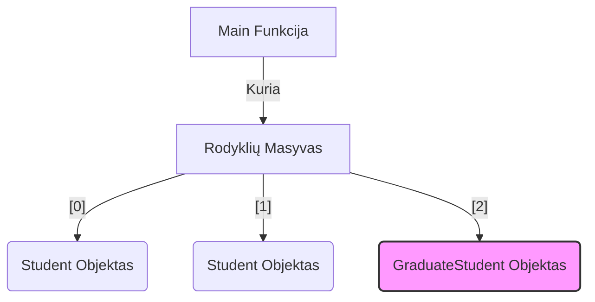

### Stack realizacijos palyginimas

=== "1 Etapas: C stilius"

    ```c
    // Globalūs kintamieji
    char stack[10];
    int top = 0;
    
    void push(char c) {
        stack[top++] = c;
    }
    ```

=== "6 Etapas: C++ Klasė"

    ```cpp
    class Stack {
    private:
        char stack[10];
        int top;
    public:
        void push(char c) {
            stack[top++] = c;
        }
    };
    ```

=== "10 Etapas: Modern C++"

    ```cpp
    #include <vector>
    
    template<typename T>
    class Stack {
        std::vector<T> data;
    public:
        void push(T item) {
            data.push_back(item);
        }
    };
    ```

### Rodyklių masyvo struktūra



#### C. Admonitions (Perspėjimai)

!!! warning "Dažna klaida: Object Slicing"
    Jei priskirsite `GraduateStudent` objektą į `Student` kintamąjį (ne rodyklę),
    papildomi duomenys bus **nupjauti**!

```cpp
    Student s = GraduateStudent("Jonas"); // Blogai!
```

!!! tip "Patarimas"
    Visada naudokite `std::vector` vietoj `new[]` masyvų, nebent turite labai specifinę priežastį.

!!! note "Pastaba"
    note, kad jums ir tada reikia naudoti `new[]` masyvų.

!!! info "Informacija"
    info, kad jums ir tada reikia naudoti `new[]` masyvų.
